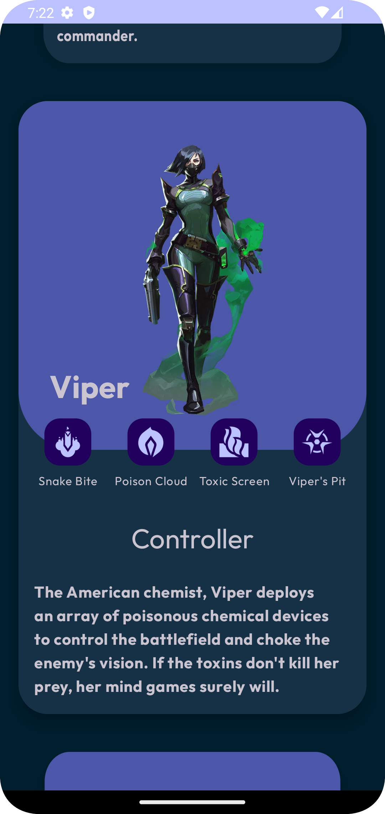
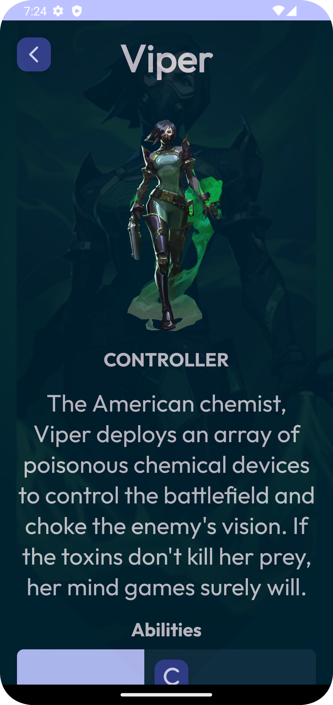
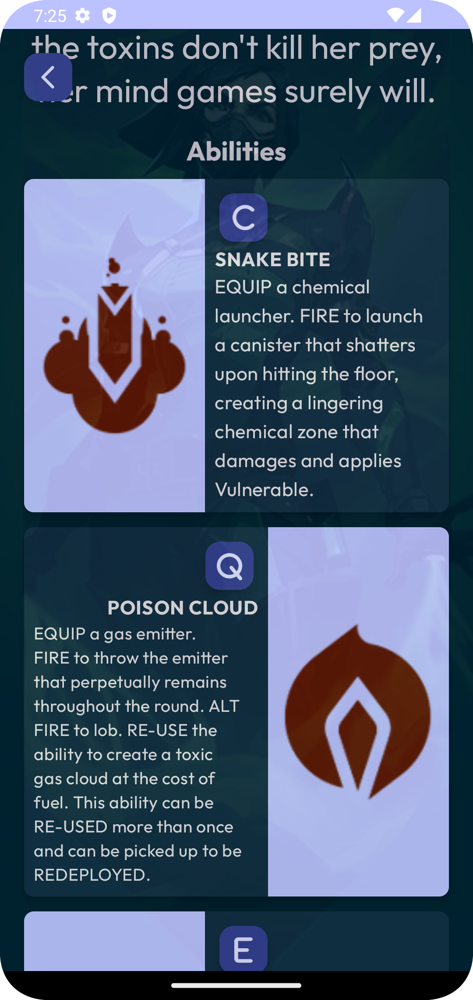

# AgentPro  

AgentPro es una aplicación de catálogo de agentes diseñada para entusiastas del videojuego Valorant. Proporciona información detallada sobre cada uno de los agentes disponibles en el juego, incluyendo sus habilidades, roles y descripciones.

## Funcionalidades y Características ✨

-   Visualización de una lista de agentes con sus respectivas imágenes, nombres y roles.
-   Detalles de cada agente, incluyendo una imagen de fondo, imagen del agente, habilidades y descripción.
-   Desplazamiento automático de la lista de agentes para una experiencia de visualización fácil.
-   Navegación fluida entre la lista de agentes y los detalles de cada agente.
-   Diseño moderno y atractivo.

## Tecnologías Utilizadas 🛠️

-   Java: El lenguaje de programación principal utilizado para el desarrollo de la aplicación.
-   Android Studio: El entorno de desarrollo integrado (IDE) utilizado para construir la aplicación de Android.
-   XML: Lenguaje de marcado utilizado para definir la interfaz de usuario de la aplicación.
-   RecyclerView: Componente de Android utilizado para mostrar una lista de elementos desplazables de manera eficiente.
-   ViewPager2: Componente de Android utilizado para implementar el desplazamiento automático en la lista de agentes.
-   Serializable: Interfaz de Java utilizada para permitir el paso de objetos entre actividades.
-   Material Design: Principios y directrices de diseño utilizados para crear una interfaz de usuario moderna y coherente.

## Aprendizaje y Destrezas Adquiridas 🦾

Durante el desarrollo de este proyecto, he aprendido y aplicado los siguientes conceptos y técnicas:

-   Creación y personalización de actividades de Android.
-   Implementación de RecyclerView y adaptadores para mostrar listas de elementos.
-   Uso de ViewPager2 para implementar el desplazamiento automático.
-   Paso de datos entre actividades utilizando la interfaz Serializable.
-   Diseño de una interfaz de usuario atractiva siguiendo los principios de Material Design.
-   Manejo de eventos de clic y navegación entre actividades.

## Capturas de Pantalla 🖼️

  

## Instalación y Uso 📥

1.  Clona o descarga el repositorio en tu máquina local.
```bash 
git clone https://github.com/DaveDeveloper117/AgentPro.git
```
3.  Abre el proyecto en Android Studio.
4.  Ejecuta la aplicación en un emulador de Android o dispositivo físico.
5.  O descarga directamente el apk desde aquí [AgentPro](https://github.com/DaveDeveloper117/AgentPro/releases/download/v1.0/app-debug.apk)

## Contribución 🤝

Las contribuciones son bienvenidas. Si deseas mejorar el proyecto, puedes hacer un fork del repositorio, realizar tus cambios y enviar una pull request.

## Licencia 🗝️

El proyecto está licenciado bajo [MIT License](https://github.com/DaveDeveloper117/AgentPro/blob/master/LICENSE).

## Contacto 📩

Si tienes alguna pregunta o sugerencia, no dudes en ponerte en contacto conmigo a través de mi dirección de correo electrónico: [dabicho803@gmail.com](mailto:dabicho803@gmail.com).

